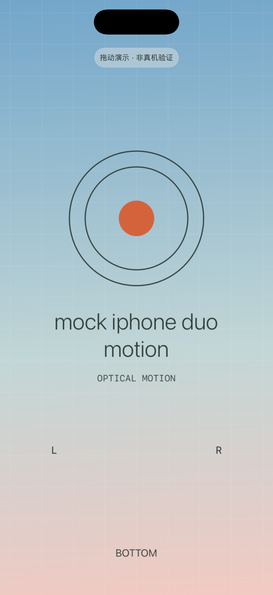
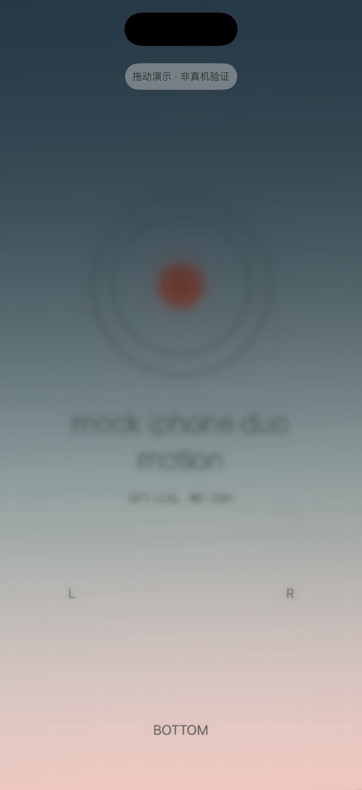

# mock iphone duo motion

An iPhone motion-driven optical display experiment, built with SwiftUI, Core Motion and Metal. Choose a photo, calibrate, and tilt the phone to see spatial blur and a dark translucent gradient.

一个用手机姿态驱动的光学外屏视觉实验。转动 iPhone 时，抬高的一侧逐渐模糊、变暗，靠近推定转轴的一侧保持更清晰、明亮。支持选照片、单次点击校准和完整翻转。

**最快开始：下载源码 → 打开 `BoxDepth.xcodeproj` → 选择 iPhone 模拟器 → ⌘R。** 真机体验按下面的个人签名步骤操作。

## 效果与范围

| 正面 | 抬起 45° |
|---|---|
|  |  |

截图来自模拟器，用于展示渲染变化；真实的跟手感与空间错觉需要拿着 iPhone 观察。显示内容来自项目内置测试图。

- iPhone、iOS 17+，固定竖屏；SwiftUI + Core Motion + MetalKit。
- 从系统照片选择器导入单张照片，支持填满/完整显示；最长边缩小到 2048 像素。
- 点击后自动采样校准，容许轻微手抖；抬高侧约 45° 已出现深色渐变。
- 支持翻到背面再翻回，背向时显示稳定暗面。
- 只提供光学外屏；设置包含视差强度、图片适配和重新校准。
- 无第三方运行依赖、摄像头、震动、声音、服务器或账号系统。

这是独立视觉原型。仅使用姿态传感器，不跟踪眼睛、真实转轴或整体平移；反光为程序模拟。请保持观看位置大致固定。目标渲染速率为 60fps，未将其视为所有机型的性能保证。

## 准备环境

- 一台能够运行完整 Xcode 的 Mac。仅安装 Command Line Tools 不够。
- Xcode 及 iOS SDK/模拟器运行时，版本需要支持你的手机系统；本项目已使用 Xcode 26.5 验证。
- 真机：iOS 17+ 的 iPhone、数据线、自己的 Apple 账号。已在 iPhone 11 / iOS 18.7.8 上安装运行。
- 模拟器预览不需要开发者签名；个人真机测试可以使用免费 Apple 账号。

下载方式：GitHub 页面选择 **Code → Download ZIP** 并解压，或者：

```bash
git clone https://github.com/orange90/mock-iphone-duo-motion.git
cd mock-iphone-duo-motion
open BoxDepth.xcodeproj
```

工程已经生成，普通使用者不需要安装 XcodeGen，也不需要安装 CocoaPods 或下载 Swift Packages。内部 target/scheme 名为 `BoxDepth`，手机桌面显示 `mock iphone duo motion`。

## 先在模拟器运行

1. Xcode 顶部 scheme 选择 **BoxDepth**。
2. 运行目标选择一个已安装的 **iPhone Simulator**，不要选择 “Any iOS Device”。如没有模拟器，先在 Xcode 的设置中安装 iOS 平台运行时。
3. 按 **⌘R**，启动后应看到蓝粉渐变的内置测试图和“拖动演示”提示。
4. 上下/左右拖动模拟倾斜，或点击 0°、45°、90°、180° 与“回放”。

模拟器没有真实陀螺仪，不能用来判断真机动作延迟或裸眼空间感。

## 用自己的账号签名并安装到 iPhone

仓库没有预设开发团队，也没有作者的证书、私钥或描述文件。**每位使用者用自己的 Apple 账号签名。**

1. 打开 **Xcode → Settings → Accounts**，登录自己的 Apple 账号。
2. 左侧选择蓝色工程图标，在 **TARGETS** 下选择 **BoxDepth**，打开 **Signing & Capabilities**。
3. 勾选 **Automatically manage signing**，**Team** 选择自己的 **Personal Team** 或已有开发团队。
4. 把 **Bundle Identifier** 从占位值 `org.example.MockIPhoneDuoMotion` 改为自己的唯一值，例如 `com.yourname.mockiphoneduomotion`；请把 `yourname` 换成自己的标识。以后保持这个值，可覆盖升级并保留照片。
5. 用数据线连接并解锁 iPhone，手机弹出“信任此电脑”时确认。
6. 按 Xcode 提示在手机 **设置 → 隐私与安全性 → 开发者模式** 中启用，重启并再次确认。若开关尚未出现，先让 Xcode 在 **Window → Devices and Simulators** 中识别和配对设备。
7. Xcode 运行目标选择这台 iPhone，按 **⌘R**。让 Xcode 自动创建签名所需的开发证书和描述文件。
8. 若手机提示开发者未受信任，在 **设置 → 通用 → VPN 与设备管理** 中信任你自己的开发身份，再打开应用。

如果要在真机上运行单元测试，`BoxDepthTests` target 也应选择自己的 Team，并使用自己的唯一测试 Bundle ID；仅运行应用不需要先配置测试 target。

免费账号可用于个人真机测试，不要求购买开发者会员；免费配置描述文件有效期通常为 7 天，到期后重新编译安装即可。免费账号有 App ID 和设备数量限制，具体以 [Apple 会员对比](https://developer.apple.com/support/compare-memberships/) 和 [开发者账户说明](https://developer.apple.com/help/account/basics/about-your-developer-account) 为准。设备操作参见 [Apple 真机运行说明](https://help.apple.com/xcode/mac/current/en.lproj/dev5a825a1ca.html)。

**不要把自己的签名证书、`.p12`、`.p8`、私钥或 `.mobileprovision` 文件提交到仓库。** Fork 后对 Team/Bundle ID 的本地修改无需作为贡献提交。

## 如何体验

1. 屏幕正对自己，点一次“校准”，稍稳住手机。通常约半秒完成，无需反复点击。
2. 保持头部位置大致不动，慢慢转动手机，观察抬高侧的模糊与暗色渐变。
3. 工具在校准完成约 7 秒后隐藏；轻点画面可重新显示。
4. 进入后台后再次打开需要重新校准。明显晃动时校准会等待，约 4 秒仍未稳定会提示重试。
5. 可选择自己的照片；“恢复默认设置”保留照片，“使用内置测试图”则替换当前照片。

应用删除会清除本机图片与设置。更新时使用相同 Bundle ID 和签名团队，以覆盖原应用。

## 常见问题

| 现象 | 处理 |
|---|---|
| Signing requires a development team | 在 **BoxDepth target** 选择自己的 Team；模拟器预览请选择模拟器运行目标。 |
| Bundle identifier cannot be registered / No profiles found | 更换为自己的唯一 Bundle ID，确认自动签名已启用、Apple 账号可登录且网络正常。 |
| iPhone 未出现在运行目标中 | 解锁、检查数据线、信任电脑，在 Devices and Simulators 完成配对；Xcode 需支持该手机系统。 |
| Developer Mode disabled / Untrusted Developer | 按上面的步骤启用开发者模式、重启，并信任自己的开发身份。 |
| 使用几天后打不开 | 免费签名可能到期，连接 Mac 后在 Xcode 重新运行。 |
| 校准一直等待 | 面向屏幕点一次后停止明显转动；轻微手抖不需要刻意消除。确认允许该应用使用运动数据。 |
| 选图失败或照片在 iCloud | 等待系统完成下载后重试；读取失败时保留原图片。 |
| 命令行提示需要 Xcode | 使用完整 Xcode，并按下方命令设置 `DEVELOPER_DIR`，无需修改全局工具路径。 |

## 开发与测试

在 Xcode 中选择模拟器后按 **⌘U**，可运行现有 16 项测试。测试覆盖图片方向/颜色、旧设置兼容、Metal 光学渐变及手持校准。[验证范围](docs/TESTING.md)

数学测试：

```bash
bash Scripts/test-math.sh
```

无签名 iPhone 架构构建（只能检查编译，不能直接安装手机）：

```bash
DEVELOPER_DIR=/Applications/Xcode.app/Contents/Developer xcodebuild \
  -project BoxDepth.xcodeproj -scheme BoxDepth \
  -destination 'generic/platform=iOS' \
  -derivedDataPath /tmp/mock-iphone-duo-motion-build \
  CODE_SIGNING_ALLOWED=NO build
```

模拟器测试（先把 `YOUR_SIMULATOR_UDID` 替换为自己的模拟器 ID，可用 `xcrun simctl list devices available` 查询）：

```bash
DEVELOPER_DIR=/Applications/Xcode.app/Contents/Developer xcodebuild \
  -project BoxDepth.xcodeproj -scheme BoxDepth \
  -destination 'platform=iOS Simulator,id=YOUR_SIMULATOR_UDID' \
  -derivedDataPath /tmp/mock-iphone-duo-motion-tests \
  CODE_SIGNING_ALLOWED=NO test
```

`project.yml` 仅用于维护者用 XcodeGen 重新生成工程；普通用户直接打开已提交的工程。标准 Metal 着色器以 `BoxShader.txt` 随应用打包，在启动时本地编译，不下载远程代码，也不要求另外安装 Metal 构建工具链。

更多实现细节见 [光学模型](docs/OPTICS.md)。问题反馈请提交 [GitHub Issue](https://github.com/orange90/mock-iphone-duo-motion/issues)，附机型、系统版本、复现动作和预期效果；不要附签名凭据、设备标识或私密照片。

## 许可

[MIT License](LICENSE)。
